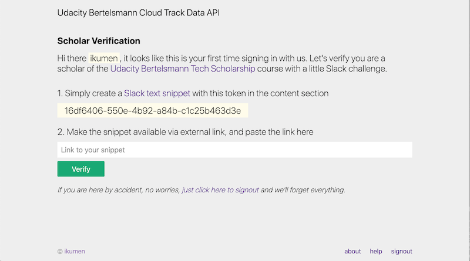

# Udacity Bertelsmann TS Cloud Track Data API

Data provider for scholars enrolled in [Udacity Bertelsmann Tech Scholarship Cloud Track](https://www.udacity.com/bertelsmann-tech-scholarships) challenge course, consume it and build something cool.

* [Overview](#overview)
* [Data API](#data-api)
  - [Security](#security)
  - [API Endpoints](#api-endpoints)
* [Production](#production)
* [Development](#development)
  - [Configuration](#configuration)
  - [Build and Run](#build-and-run)


## Overview

What does it do? In simple terms: takes data from the Udacity Bertelsmann TS Cloud Track community of scholars, loads it into a SQL Database, then provides the data via an API for our community of scholars to consume. The goal is to showcase how various Azure services can be utilized to implement the following architecture.

```                
                       |             Azure Cloud
                       |      +----------------+
                       | +--->|  Blob Storage  |<--------------+
+----------------+     | |    +-------|--------+               |
|   User Data    |     | |    +-------v--------+      +--------V--------+
|  from various  |-----^-+--->|  Azure Event   |----->| Azure Functions |  
|    sources     |     |      |     Grid       |      +--------+--------+
+----------------+     |      +----------------+               |     
                       |                                       |
                       |      +----------------+     +---------v----------+
+------------+         |      | UBTS Data API  |     | Azure SQL Database |
| +----------+-+       |      | (App Service)  |     +---------+----------+
| |  Awesome   |       |      |                |<--------------+
| |   Apps     |<------^------| /students      |
+-|            |       |      | /messages      |     +--------------------+
  +------------+       |      +--------+-------+     | Microsoft Identity |
        ^--------------^---------------^-------------|      Platform      |
                       |                             +--------------------+
                       |
```

### Core Components

The functional scope of the project covers the components listed under the Azure cloud section, how those components injest data, and how they integrate with one another. 

- [Azure Blob storage]() less frequently updated data are published to a blob container, then picked up via Event triggered Function for ingesting into our database
- [Azure Event Grid](https://azure.microsoft.com/en-us/services/event-grid/) frequently updated data is published to our Event Grid and queued for processing
- [Azure Functions](https://azure.microsoft.com/en-us/services/functions/) are triggered by our Event Grid to take the data and insert/updates to our SQL Database
- [Azure SQL Database](https://docs.microsoft.com/en-us/azure/azure-sql/database/) our data store
- UBTS Cloud Track Data API (via [Azure App Services](https://azure.microsoft.com/en-us/services/app-service/)) app, exposes the data for consuming apps

#### UBTS Cloud Track Data API

The [UBTS Cloud Track Data API](//ubtsapi.azurewebsites.net) is a Flask app with two modules, the API server and a SPA user dashboard for managing applications and API keys.

##### SPA User Dashboard

   


## Data API

### Security

Access to the API is granted in two steps, the first being an [OAuth authorization code flow](https://auth0.com/docs/flows/authorization-code-flow) to an external OAuth provider. After the OAuth provider has identified the user, we then verify the user is a scholar of Udacity/Bertelsmann TS Cloud Track with a simple Slack user challenge&mdash;note this verification only needs to be performed once on initial sign in. For subsequent sign ins, we rely on trust that the OAuth provider is sending us back the same user, of which we have already verified from the initial sign in.

If you look at our sequence diagram below, you'll notice steps 1-8 are like any other [OAuth authorization code flow](https://auth0.com/docs/flows/authorization-code-flow). Steps 9-10 is our custom Slack user challenge.

9) if the user returned from an OAuth provider in step 8 is new, we given them a short live token and ask them to publish this token as a [Slack snippet](https://slack.com/help/articles/204145658-Create-a-snippet)
10) we then verify the publish snippet contains the token, thus confirming they are a member of our community of scholars

```             
[ User ]     [UBTSCT Data API]   [OAuth Provider]    [UBTSCT Slack Workspace]
    |               |                    |                  |
 (1)|-------------->|                    |                  |
    |            (2)|------------------->|                  |
    |<--------------^--------------------|(3)               |
 (4)|---------------^------------------->|                  |
    |               |<-------------------|(5)               |
    |            (6)|------------------->|--+               |
    |               |                    |  |(7)            |
    |               |<-------------------|--+               |
    |<--------------|(9)                 | (8)              |
    |               |                    |                  |
    |               |<-------------------^----------------->|
    |               |       (10)         |                  |
```

Once the user has access to the API, they can register an application and receive an API key that must be sent along with every request to the API.

#### Endpoint Authentication

All requests to `/api/resource/*` endpoints require an "Authorization" header with the API key obtained during application registration (above) as the value.

```
Authentication: <your API key>
```

### API Endpoints

Requests that return lists of items will be paginated. You can customize how the results are paged back with the following parameters.

| Parameter | Type | In | Description |
| :-- | :-- | :-- | :-- |
| `page` | integer | query | (optional) the page to return, defaults to 1, invalid page will return 404 |
| `per_page` | integer | query | (optional) the page size, defaults to 100, valid range 10 <= size <= 100 |

A typical paginated response looks like this, `items` will contain the resource items being returned.
```json
{
  "items": [{...}, ],
  "page": 1,
  "per_page": 100,
  "total": 2000
}
```

The API offers the following data sets and their respective endpoints. 

#### List Slack Users

List all Slack users.

```
[GET] /api/resource/slack/users
```
##### Parameters
| Name | Type | In | Description |
| :-- | :-- | :-- | :-- |
| `tz_offset` | string | query | (optional) only show users with given time zone offset from GMT. Format expected: `UTC+03:00` |
| `sort` | string | query | (optional) field to sort by with sort direction (comman separated e.g, `?sort=name,desc`). Sortable fields include: `id`, `name`, `full_name`, and `tz_offset`.  |

##### Example Request

Here's an example with [httpie](https://httpie.io/)
```bash
http https://ubtsapi.azurewebsites.net/api/resource/slack/users Authorization:xOZWX3KofjPQ4jjr6MV6sP7BhiEglz2jzmiWg tz_offset==UTC+03:00 per_page==10
```
##### Example Response
```
Status: 200 OK
```
```bash
{
 "items":[
   {"id":"U0001UBTSCT","name":"Arthur","avatarId":"abcdef123451","fullName":"Terry Gilliam","title":"","offset":"UTC+03:00"},
   {"id":"U0002UBTSCT","name":"Badger","avatarId":"abcdef123452","fullName":"Eric Idle","title":"","offset":"UTC+03:00"},
  ...
  ],
  "page": 1,
  "per_page": 10,
  "total": 2441
}
```

#### Slack Channels

List all Slack channels.

```
[GET] /api/resource/slack/channels
```
##### Parameters

| Name | Type | In | Description |
| :-- | :-- | :-- | :-- |
| `sort`  | string | query | (optional) field to sort by with sort direction (comman separated e.g, `?sort=name,desc`). Sortable fields include: `id`, `name`.  |

<br/>

##### Example Request

Here's an example with [httpie](https://httpie.io/)
```bash
http https://ubtsapi.azurewebsites.net/api/resource/slack/channels Authorization:xOZWX3KofjPQ4jjr6MV6sP7BhiEglz2jzmiWg per_page==10
```

##### Example Response
```
Status: 200 OK
```
```bash
{
 "items":[
    {"name":"channel_01","id":"CUBTSCT0001","description":"Description for channel 1","members":6},
    {"name":"channel_02","id":"CUBTSCT0002","description":"Description for channel 2","members":1},
    {"name":"channel_03","id":"CUBTSCT0003","description":"Description for channel 3","members":6},
    ...
  ],
  "page": 1,
  "per_page": 10,
  "total": 94
}
```

#### Slack Messages

List all Slack messages. 

```
[GET] /api/resource/slack/messages
```
##### Parameters

| Name | Type | In | Description |
| :-- | :-- | :-- | :-- |
| `thread_id` | string | query | (optional) show messages belonging to thread with this `thread_id`. Format expected: Unix epoc format `1607972627.028300`. |
| `channel_id` | string | query | (optional) show messages in channel with `channel_id`. Format expected: uppercase 11 alphanumeric characters. See [Slack Channels endpoint](#slack-channels) for list of channels. |
| `user_id` | string | query | (optional) show messages belonging to given user with `user_id`. Format expected: uppercase 11 alphanumeric characters. See [Slack Users endpoint](#slack-users) for list of users. |
| `sort`  | string | query | (optional) field to sort by with sort direction (comman separated e.g, `?sort=name,desc`). Sortable fields include: `id`, `channel_id`, `user_id`.  |

<br/>

##### Example Request

Here's an example with [httpie](https://httpie.io/)
```bash
http https://ubtsapi.azurewebsites.net/api/resource/slack/messages Authorization:xOZWX3KofjPQ4jjr6MV6sP7BhiEglz2jzmiWg per_page==10
```

##### Example Response
```
Status: 200 OK
```
```bash
{
 "items":[
{
      "channel_id": "CD1GNFG123V", 
      "content": "Hi everyone....", 
      "files": [], 
      "id": "1607911117.028300", 
      "reactions": [], 
      "thread_id": "1222222627.028300", 
      "user_id": "U0000000000"
    }, 
    {
      "channel_id": "CD1GN5B1J3V", 
      "content": "Starting with D1 again because was ....", 
      "files": [], 
      "id": "1333331979.486600", 
      "reactions": [
        {
          "emoji_id": ":+1:", 
          "user_id": "U01GGFJDM5X"
        }, 
        {
          "emoji_id": ":spinny_toast:", 
          "user_id": "U01GTMHMFDW"
        }, 
      ], 
      "thread_id": "1222222627.028300", 
      "user_id": "U01EEEEE733"
    }, 
    ...
  ],
  "page": 1,
  "per_page": 10,
  "total": 19000
}
```

Get a Slack message. 

```
[GET] /api/resource/slack/messages/<channel_id>/<message_id>
```
##### Parameters

| Name | Type | In | Description |
| :-- | :-- | :-- | :-- |
| None | | | |
<br/>

##### Example Request

Here's an example with [httpie](https://httpie.io/)

```bash
http https://ubtsapi.azurewebsites.net/api/resource/slack/messages/CGH67535RDE5/1600000000.000000  Authorization:xOZWX3KofjPQ4jjr6MV6sP7BhiEglz2jzmiWg per_page==10
```

##### Example Response
```
Status: 200 OK
```
```bash
{
 "channel_id": "CGH67535RDE5", 
  "content": "Starting with D1 again because was stuck on .. ", 
  "files": [], 
  "id": "1600000000.000000", 
  "reactions": [
    {
      "emoji_id": ":+1:", 
      "user_id": "U077777DM5X"
    }, 
    {
      "emoji_id": ":spinny_toast:", 
      "user_id": "U0AAAAAQGGY"
    }
  ], 
  "thread_id": "1600000000.000000", 
  "user_id": "U01GG888883"
}
```

#### Slack Emojis

List all Slack emojis used in Udacity Bertelsmann Cloud Track workspace.

```
[GET] /api/resource/slack/emojis
```
##### Parameters

| Name | Type | In | Description |
| :-- | :-- | :-- | :-- |
| `sort`  | string | query | (optional) field to sort by with sort direction (comman separated e.g, `?sort=id,desc`). Sortable fields include: `id`.  |

<br/>

##### Example Request

Here's an example with [httpie](https://httpie.io/)
```bash
http https://ubtsapi.azurewebsites.net/api/resource/slack/emojis Authorization:xOZWX3KofjPQ4jjr6MV6sP7BhiEglz2jzmiWg per_page==10
```

##### Example Response
```
Status: 200 OK
```
```bash
{
 "items":[
    {"id": ":zzz:", "url": "https://a.slack-edge.com/production-standard-emoji-assets/13.0/google-small/1f4a4.png"}, 
    {"id": ":zany_face:", "url": "https://a.slack-edge.com/production-standard-emoji-assets/13.0/google-small/1f92a.png"}, 
    {"id": ":yoda:", "url": "https://emoji.slack-edge.com/T01ETQ25VK3/yoda/8b874f813087986e.gif"},    
    ...
  ],
  "page": 1,
  "per_page": 10,
  "total": 680
}
```
#### Slack Files

List all Slack files (just links) that were found in messages.

```
[GET] /api/resource/slack/files
```
##### Parameters

| Name | Type | In | Description |
| :-- | :-- | :-- | :-- |
| `channel_id` | string | query | (optional) show only files from channel with given `channel_id`. See [Slack Channel endpoint](#slack-channels) for list of channels. |
| `message_id` | string | query | (optional) show only files from message with given `message_id`. |
| `sort`  | string | query | (optional) field to sort by with sort direction (comman separated e.g, `?sort=channel_id,desc`). Sortable fields include: `channel_id`, `message_id`.  |

<br/>

##### Example Request

Here's an example with [httpie](https://httpie.io/)
```bash
http https://ubtsapi.azurewebsites.net/api/resource/slack/files Authorization:xOZWX3KofjPQ4jjr6MV6sP7BhiEglz2jzmiWg per_page==10
```

##### Example Response
```
Status: 200 OK
```
```bash
{
 "items":[
    {"channel_id": "C1111106AUD", 
      "message_id": "1611111093.022000", 
      "url": "https://files.slack.com/files-pri/T01QQQQQVK3-F01JSSSSSQ8/stylish-happy-new-2021-year-template_71609-1506.jpg"}, 
    {"channel_id": "C0111116AUD", 
      "message_id": "1611111282.032900", 
      "url": "https://files.slack.com/files-pri/T0SSSSS5VK3-F01SSSSSJBF/download/screenshot_20210101-103206.png"},
    ...
  ],
  "page": 1,
  "per_page": 10,
  "total": 1400
}
```

#### API Errors

Should an error occur, one of the following errors and messages will be returned.

| Code | Error | Comment |
| :-- | :-- | :-- |
| `500` | `Doh, please try again later!` | Something went wrong on our end, try again later. |
| `404` | `Sorry, we can't seem to find the requested page.` | Self-explanatory |
| `401` | `Whoa there buddy, doesn't look like you're authorized.` | Self-explanatory |
| `400` | `Hmm, I didn't understand your request.` | You're probably missing some input or request parameter, check your request and try again. |

For example a 404.
```bash
$ http https://ubtsapi.azurewebsites.net/api/resource/slack/foobar

HTTP/1.0 404 NOT FOUND
Content-Length: 66
Content-Type: application/json
Date: Sat, 13 Feb 2021 06:49:12 GMT
Server: Werkzeug/1.0.1 Python/3.8.3

{
    "error": "Sorry, we can't seem to find the requested page."
}
```


## Development

If you would like to contribute, fork or simply demo this project, here's some info to help you run this locally.

You should have the following installed:

- [Python 3.7 or later](https://www.python.org/downloads/)
- [pyenv](https://github.com/pyenv/pyenv) (it's not needed, but makes life easier if you need to switch between Python versions)
- [Docker](https://docs.docker.com/get-docker/)
- [sqlcmd](https://docs.microsoft.com/en-us/sql/tools/sqlcmd-utility?view=sql-server-ver15)
- [Azure CLI](https://docs.microsoft.com/en-us/cli/azure/install-azure-cli)
- and an IDE would be helpful ([Visual Studio Code is nice](https://code.visualstudio.com/)).

### Project Structure

Monorepo with everything needed to run this project.

``` bash
/alembic    # Schema management  
/backend    # Flask app supporting blueprints for API and SPA dashboard
/docs       
/frontend   # SPA user interface  
/ingester   # Azure Functions for handling data loading
/tests
application.py        # Entry point into the backend app
docker-compose.yml    # Containers for Azurite and SQL Database 
Dockerfile.sqlserver  # Cstom SQL Server dockerfile to create init scripts
manage.py             # Entry point for alembic schema manager               
```

### Configuration

Configuration is modeled after [12-factor](https://12factor.net/) practices, all configurations are either declared directly in [settings.py](/backend/settings.py) or read from environment variables. On Azure, we'll use [App Service configurations](https://docs.microsoft.com/en-us/azure/app-service/configure-common) to provide the environment variables. Locally, during development we use [python-dotenv](https://github.com/theskumar/python-dotenv) to load a local `.env` file containing all the local configurations, including secrets. This local configuration file should not be checked into source control, so an [entry to have it ignored already exists in `.gitignore`](/.gitignore#L105)

To start, an [example `.env`](/.example-env) has been created at the base of this repo, just rename it to `.env` to use.

#### Setting Up OAuth Providers

The following steps are required for setting up OAuth.

##### Microsoft/Azure 

1. sign into the [Azure Portal](https://portal.azure.com), find `Azure Active Directory`
1. from `Azure Active directory` left menu, select `App registrations`
1. from `New registration` page, enter
   - `Name`: (e.g, myapp-api, myapp-api-development)
   - `Account Types`: choose in any organization (multitenant)
   - `Redirect`: http://localhost:5000/signin/azure/complete
1. Upon completion, select `go to resource`
1. from resource page left menu, select `Certificates & secrets`
   - click `+ New client secret` 
   - take note of client secret and key

##### GitHub

1. sign into [GitHub](https://github.com) and go to [Developer Settings](https://github.com/settings/apps) page
1. from left menu, select `OAuth Apps`
1. from `OAuth Apps` page, select top right `New OAuth App` button
1. on the `Register a new OAuth application` page, enter
   - `Application name`
   - `Homepage URL`
   - `Authorization callback URL`: http://localhost:5000/signin/github/complete
1. on new OAuth application page, 
   - click `Generate a new client secret` button
   - take note of `Client ID` and `Client secrets`

After obtaining the client key/id and secrets for `Azure` and `GitHub`, add them to the example `.env` you've renamed from earlier.

### Build and Run

Before building or running anything, let's install all the required dependencies for both Python and Node modules (our SPA is Svelte).

```bash
# terminal 1
cd <project-root>
echo '3.x.x' > .python-version             # assume you're using pyenv
python -m venv .venv                       # create virtual env
. .venv/bin/activate                       # activate the virtual env
(.venv) pip install -r requirements.txt    # install python dependencies

(.venv) npm install --prefix frontend      # install node dependencies
```

Great, we're ready to build and run our app. There are basically 4 different components to build/run: 

  * containers for Blob storage and SQL Database
  * frontend SPA
  * backend app (includes both API and SPA dashboard)
  * functions

Let's bring up the docker containers for our local SQL Database/Blob storage
```bash
# terminal 2 (new terminal)
cd <project-root>
docker-compose up
```

Let's create the schema for our application.
```bash
# terminal 1 (back to previous terminal)
(.venv) python manage.py db migrate
(.venv) python manage.py db upgrade
```

The frontend SPA can be built explicitly and run from the backend server or run in a separate development server (via webpack) if you are working on the frontend.

If just building the SPA for the backend app, then
```bash
# terminal 1 (still)
(.venv) npm run build --prefix frontend   # compile the SPA
# ^will create frontend/public/static/bundle.css, frontend/public/static/bundle.js 
```
the `bundle.css` and `bundle.js` will get [picked up by the `frontend.py`](/backend/frontend.py#L14).

If you plan on developing the frontend SPA, and want hot-reloading, you'll need to run it in it's own server (via webpack).

```bash
# terminal 3 (open up new terminal)
cd <project-root>
npm run dev --prefix frontend     # start server at localhost:8080 for the SPA 
# ^calls to the backend will be proxied
```
Check http://localhost:8080 for SPA frontend.

Finally to run the backend app

```bash
# terminal 1 (back to original terminal)
(.venv) python application.py
```

Check http://localhost:5000 to access the app. 

_Note: if you are running the frontend SPA (e.g, `npm run dev`) in addition to the backend, you should access the http://localhost:8080 for SPA and http://localhost:5000/api/... for API URLs._

### Functions

[[TODO]] How do we test/emulate

## Production

[[TODO]] Runbook for prod

## Todos

- [ ] missing documentation on
  - [x] channels endpoint
  - [x] messages endpoint
  - [ ] production deployment process
  - [ ] development run Functions locally
- [ ] detailed how-to on
  - [ ] OAuth
  - [ ] SPA, Svelte
  - [ ] configurations

